# 📋 Práctica: Manipulación del DOM con JavaScript

**Alumno:** Felipe  
**Fecha:** 5 de Marzo de 2026  
**Materia:** Programación Web Profesional — 8vo Cuatrimestre

---

## 0) ¿Qué es el DOM y por qué se manipula con JavaScript?

El DOM (Document Object Model) es una representación en forma de árbol de la estructura de un documento HTML/XML que el navegador construye al cargar una página. Cada elemento, atributo y texto se convierte en un **nodo** dentro de este árbol. JavaScript es el lenguaje que permite interactuar con el DOM para **leer, modificar, agregar o eliminar** elementos de forma dinámica, sin necesidad de recargar la página. Esto es fundamental para crear interfaces interactivas y aplicaciones web modernas (SPAs, formularios dinámicos, etc.).

---

## 1) Parte A — Leer y actualizar contenido/atributos

### Investigación guiada

#### 1. Diferencia entre `textContent` e `innerHTML`

| Característica | `textContent` | `innerHTML` |
|---|---|---|
| **Devuelve** | Solo el texto plano del nodo y sus descendientes | El HTML completo (etiquetas incluidas) como cadena |
| **Asignar** | Inserta texto plano; las etiquetas se muestran literalmente | Interpreta y renderiza las etiquetas HTML |
| **Seguridad** | **Seguro** — no ejecuta código | **Riesgo de XSS** — puede ejecutar scripts inyectados |
| **Rendimiento** | Más rápido (no necesita parsear HTML) | Más lento (el navegador parsea el HTML) |

**Ejemplo:**
```javascript
element.textContent = "<b>Hola</b>"; // Muestra literalmente "<b>Hola</b>"
element.innerHTML  = "<b>Hola</b>"; // Muestra "Hola" en negrita
```

**Fuente:** [MDN textContent](https://developer.mozilla.org/en-US/docs/Web/API/Node/textContent) · [MDN innerHTML](https://developer.mozilla.org/en-US/docs/Web/API/Element/innerHTML)

---

#### 2. ¿Qué hace `classList.toggle()`?

`classList.toggle("nombreClase")` **agrega** la clase al elemento si no la tiene, o la **elimina** si ya la tiene. Devuelve `true` si la clase quedó presente, `false` si fue removida. Opcionalmente acepta un segundo parámetro booleano para forzar agregar (`true`) o quitar (`false`).

```javascript
nota.classList.toggle("destacada");
// Si tenía "destacada" → la quita
// Si no la tenía → la agrega
```

**Fuente:** [MDN classList](https://developer.mozilla.org/en-US/docs/Web/API/Element/classList)

---

#### 3. ¿Qué es `dataset` y para qué sirve?

`dataset` es una propiedad de solo lectura que da acceso a todos los **atributos `data-*`** de un elemento HTML como un objeto `DOMStringMap`. Sirve para almacenar datos personalizados directamente en el HTML sin afectar la presentación ni la semántica.

```html
<article data-id="A-1001" data-category="tech">...</article>
```
```javascript
const id = nota.dataset.id;          // "A-1001"
const cat = nota.dataset.category;   // "tech"
```

Los nombres se convierten de `kebab-case` a `camelCase` (ej. `data-user-name` → `dataset.userName`).

**Fuente:** [MDN dataset](https://developer.mozilla.org/en-US/docs/Web/API/HTMLElement/dataset)

---

### ✅ Evidencia Parte A — Los 3 botones funcionan

#### Estado inicial de la página
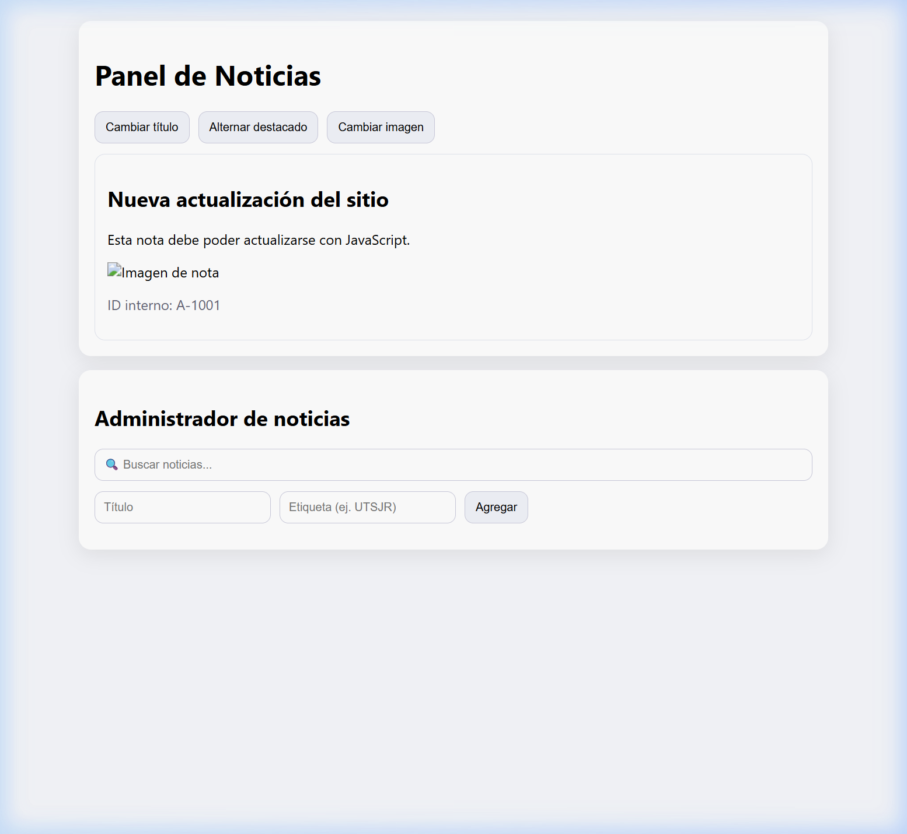

#### Botón "Cambiar título" → El título cambia a "Panel de Noticias (Actualizado)"
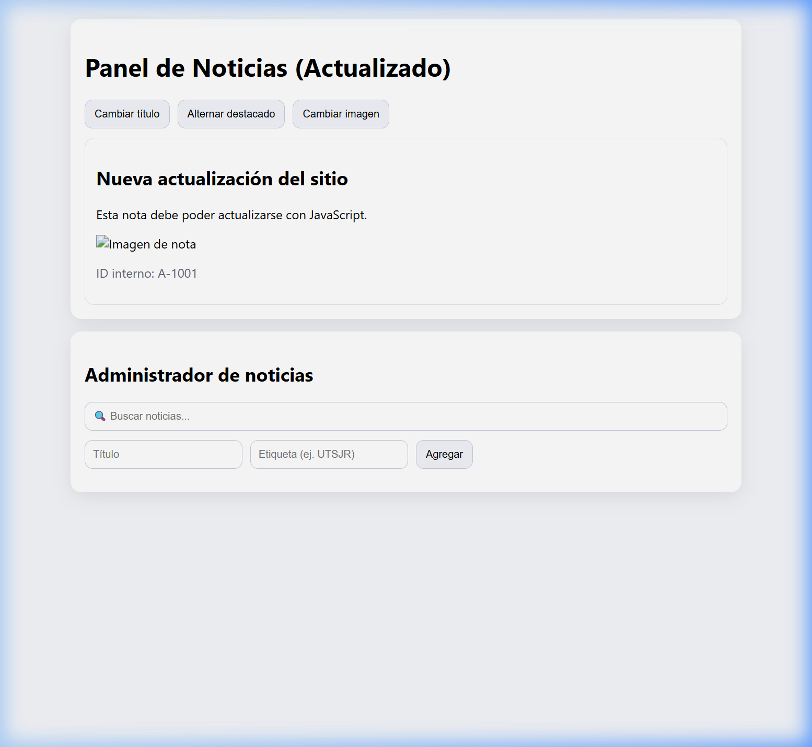

#### Botón "Alternar destacado" → La nota obtiene borde azul con `classList.toggle("destacada")`
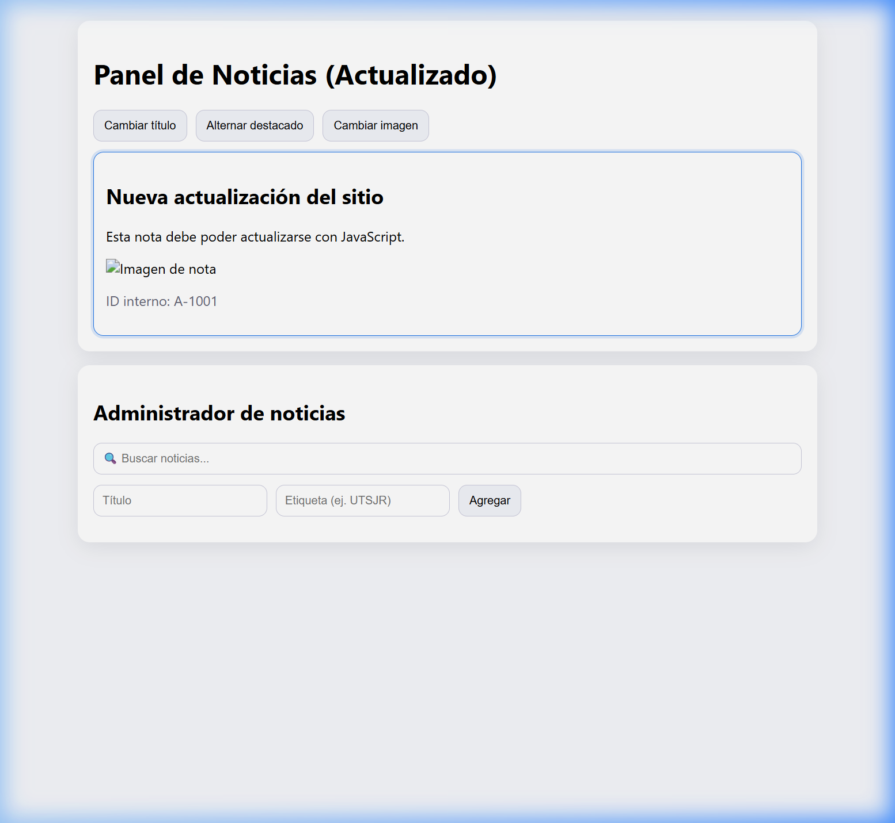

#### Botón "Cambiar imagen" → Se cambia el `src` de la imagen y se actualiza el texto
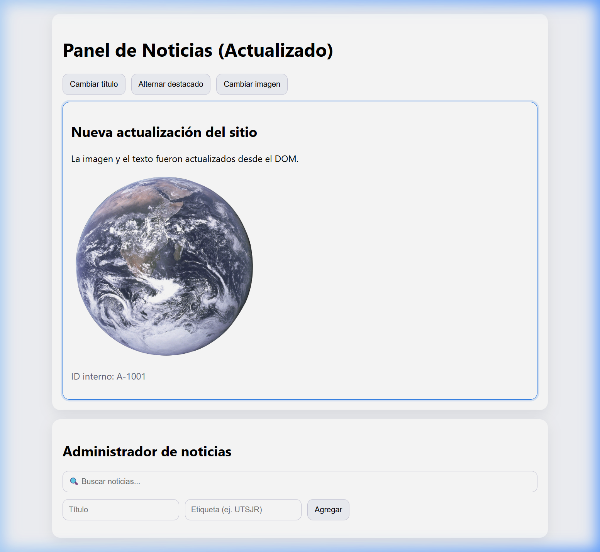

#### 🎥 Video demostración Parte A
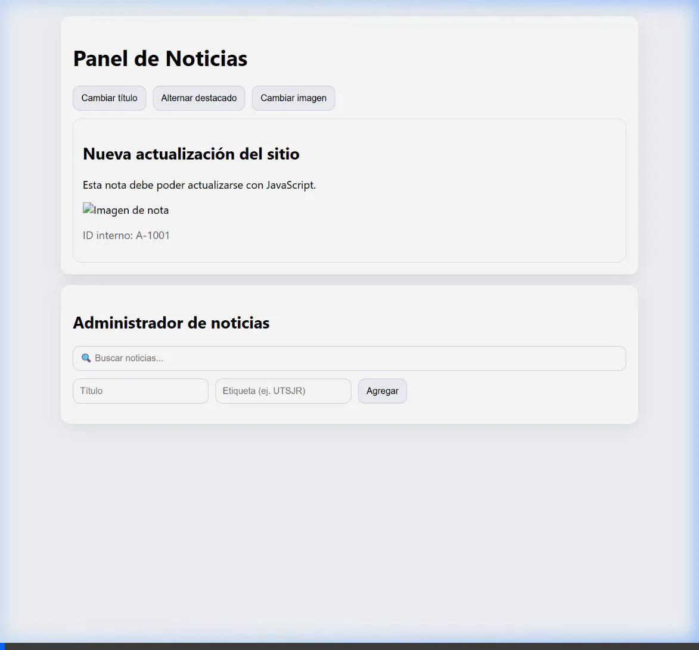

---

## 2) Parte B — Agregar y eliminar elementos del DOM

### Investigación guiada

#### 1. Diferencia entre `append`, `prepend` y `appendChild`

| Método | Acepta | Posición | Devuelve |
|---|---|---|---|
| `append()` | Nodos **y** strings | Al **final** del padre | `undefined` |
| `prepend()` | Nodos **y** strings | Al **inicio** del padre | `undefined` |
| `appendChild()` | Solo **nodos** | Al **final** del padre | El nodo insertado |

`append` y `prepend` son más modernos (API más nueva) y permiten insertar múltiples elementos y texto de una sola vez. `appendChild` es el método clásico que solo acepta un nodo DOM a la vez.

```javascript
lista.prepend(nuevoItem);          // Agrega al inicio
lista.append(nuevoItem);           // Agrega al final
lista.appendChild(nuevoItem);      // Agrega al final (clásico)
lista.append("Texto", otroNodo);   // Múltiples elementos
```

**Fuente:** [MDN append](https://developer.mozilla.org/en-US/docs/Web/API/Element/append) · [MDN appendChild](https://developer.mozilla.org/en-US/docs/Web/API/Node/appendChild)

---

#### 2. ¿Qué es "delegación de eventos" y por qué mejora rendimiento?

La **delegación de eventos** consiste en registrar un **único** event listener en un elemento padre en lugar de uno por cada hijo. Funciona aprovechando el **event bubbling**: cuando un evento ocurre en un hijo, "burbujea" hacia arriba por el DOM hasta llegar al padre.

**Ventajas de rendimiento:**
- **Menos listeners en memoria** — en vez de N listeners (uno por item), solo hay 1.
- **Funciona con elementos dinámicos** — los items creados después de registrar el listener también son capturados.
- **Menos código** — se usa `e.target.closest()` para identificar qué hijo fue clickeado.

```javascript
// En vez de agregar un listener a CADA botón:
lista.addEventListener("click", (e) => {
  const btn = e.target.closest("button");
  if (!btn) return;
  const li = e.target.closest(".item");
  // ...manejar acción
});
```

**Fuente:** [MDN Event bubbling and capture](https://developer.mozilla.org/en-US/docs/Learn/JavaScript/Building_blocks/Events)

---

### ✅ Evidencia Parte B — Agregar 3, destacar 1, eliminar 1

#### Se agregaron 3 noticias con `createElement` + `prepend` y la primera se marcó como destacada con `classList.toggle`
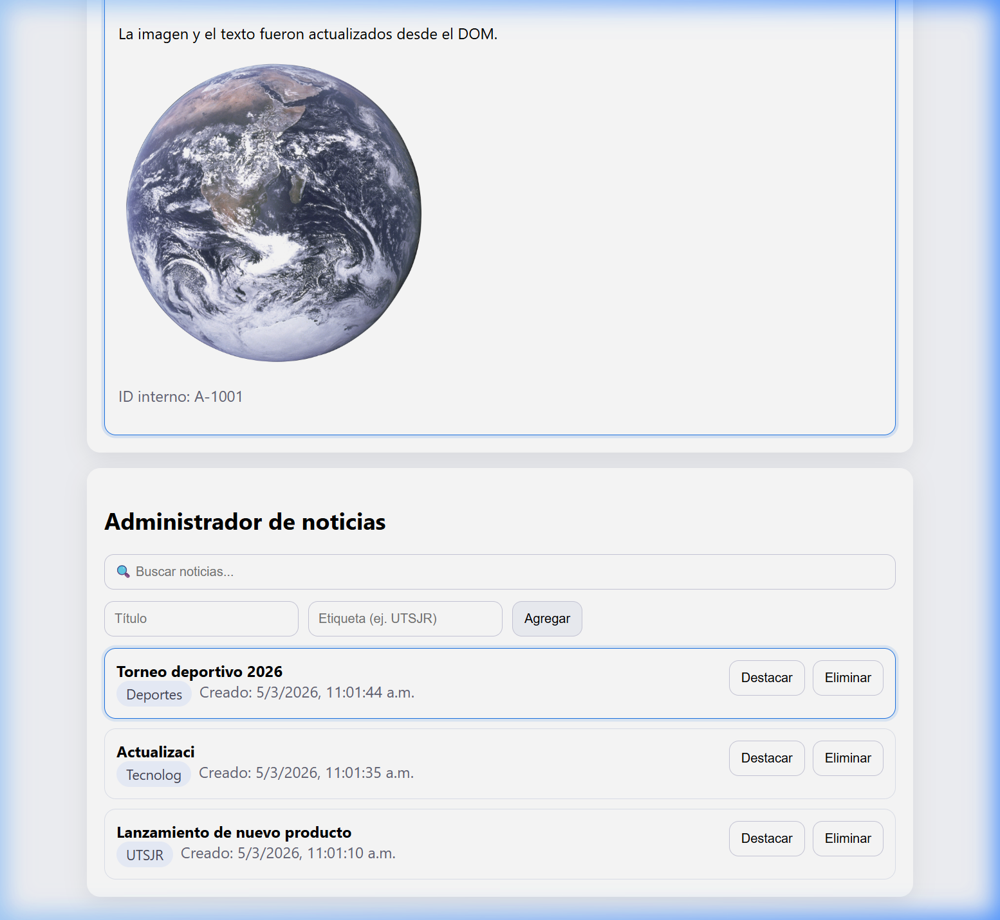

#### Se eliminó la última noticia con `remove()` — quedan 2
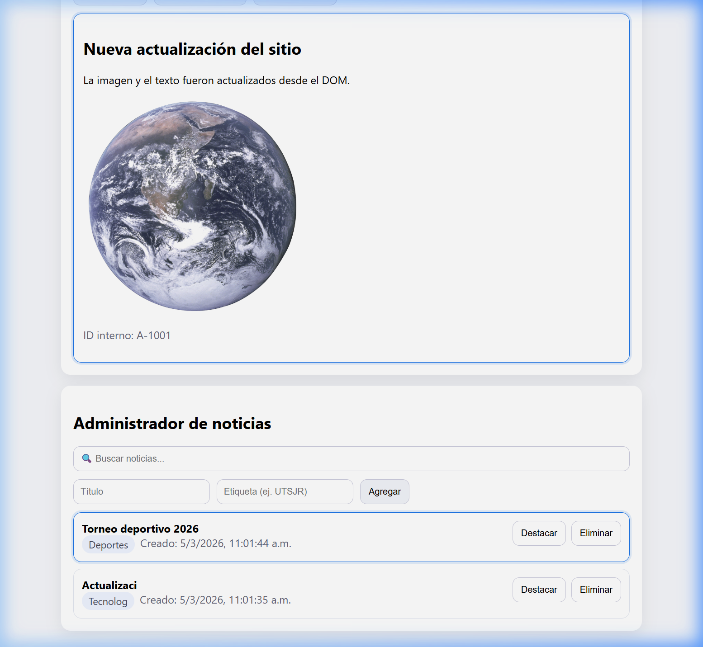

#### 🎥 Video demostración Parte B
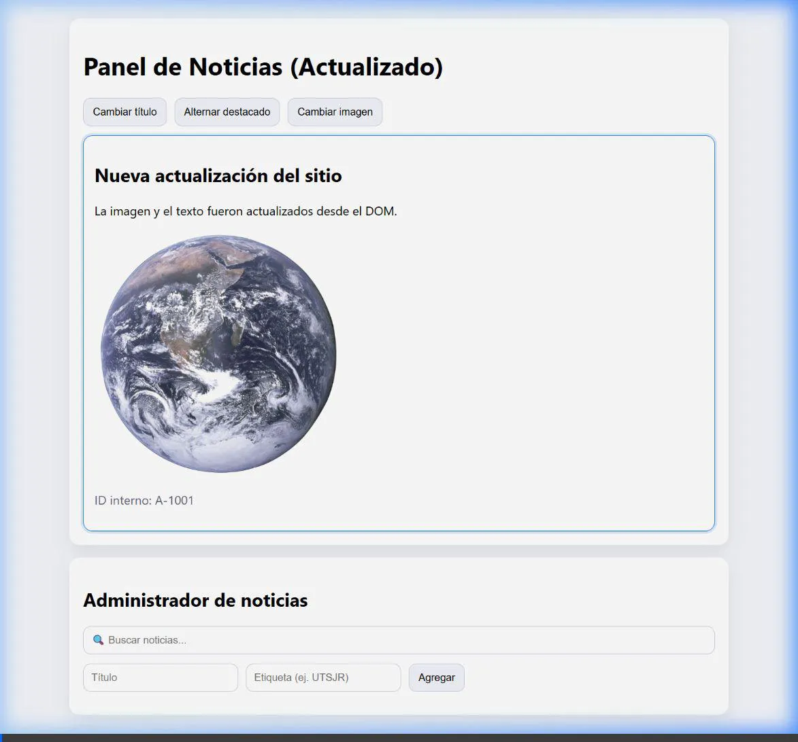

---

## 3) Parte C — Investigación aplicada: Mini reto real

En este proyecto se implementaron las **tres opciones** del mini reto:

### Opción 1: 🔍 Búsqueda local (filtrar lista por texto)

Se agregó un campo de búsqueda que escucha el evento `input` y filtra los items de la lista comparando el texto del título y la etiqueta con el valor ingresado. Los items que no coinciden reciben la clase CSS `oculto` que los oculta con `display: none`.

```javascript
inpBuscar.addEventListener("input", () => {
  const filtro = inpBuscar.value.toLowerCase().trim();
  const items = lista.querySelectorAll(".item");
  items.forEach((item) => {
    const tituloItem = item.querySelector(".item__title").textContent.toLowerCase();
    const tagItem = item.querySelector(".pill").textContent.toLowerCase();
    if (tituloItem.includes(filtro) || tagItem.includes(filtro)) {
      item.classList.remove("oculto");
    } else {
      item.classList.add("oculto");
    }
  });
});
```

**Fuente:** [MDN input event](https://developer.mozilla.org/en-US/docs/Web/API/HTMLElement/input_event)

### Opción 2: 💾 Persistencia con LocalStorage

Cada vez que se agrega, elimina o destaca un item, se serializa la lista completa a JSON y se guarda en `localStorage`. Al cargar la página, la función `cargarLista()` recupera los datos y reconstruye los nodos del DOM.

```javascript
function guardarLista() {
  const items = lista.querySelectorAll(".item");
  const datos = [];
  items.forEach((item) => {
    datos.push({
      titulo: item.querySelector(".item__title").textContent,
      tag: item.querySelector(".pill").textContent,
      fecha: item.querySelector(".muted").textContent,
      destacada: item.classList.contains("destacada"),
    });
  });
  localStorage.setItem("dom-lab-noticias", JSON.stringify(datos));
}
```

**Fuente:** [MDN localStorage](https://developer.mozilla.org/en-US/docs/Web/API/Window/localStorage)

### Opción 3: 🛡️ Seguridad DOM (evitar inyección XSS)

Se reemplazó el uso de `innerHTML` en la función `crearItem()` por creación explícita de nodos con `document.createElement()` y asignación de texto con `textContent`. Esto previene ataques XSS ya que `textContent` no interpreta HTML ni ejecuta scripts.

```javascript
// En vez de innerHTML (inseguro):
// li.innerHTML = `<strong>${titulo}</strong>`;  ❌ XSS vulnerable

// Se usa createElement + textContent (seguro):
const strong = document.createElement("strong");
strong.textContent = titulo;  // ✅ Seguro contra XSS
li.appendChild(strong);
```

**Fuente:** [OWASP XSS Prevention](https://cheatsheetseries.owasp.org/cheatsheets/Cross_Site_Scripting_Prevention_Cheat_Sheet.html)

---

### ✅ Evidencia Parte C — Búsqueda local funcionando

#### Lista completa antes de filtrar
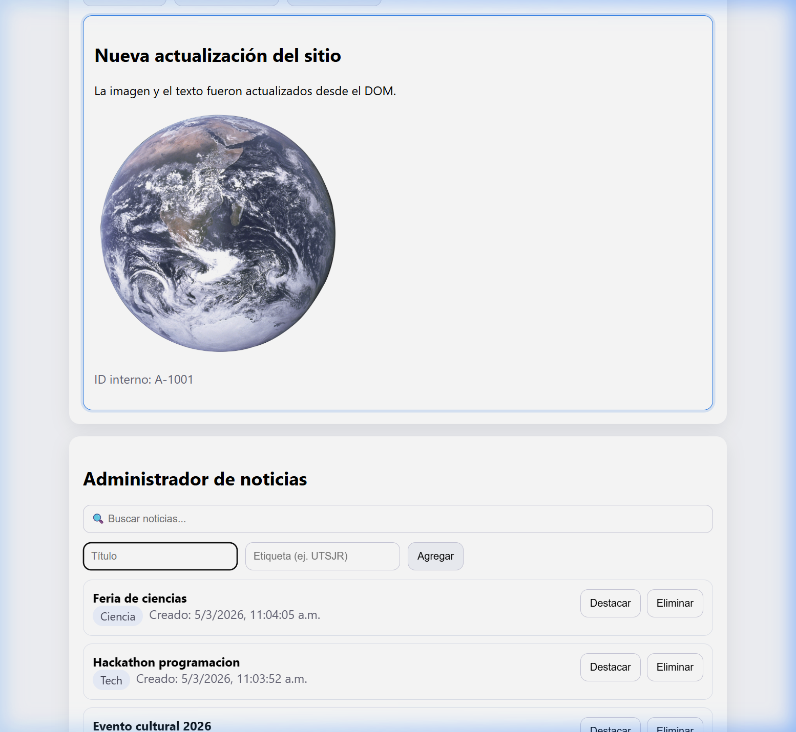

#### Filtro por título: escribir "hack" → solo muestra "Hackathon programacion"
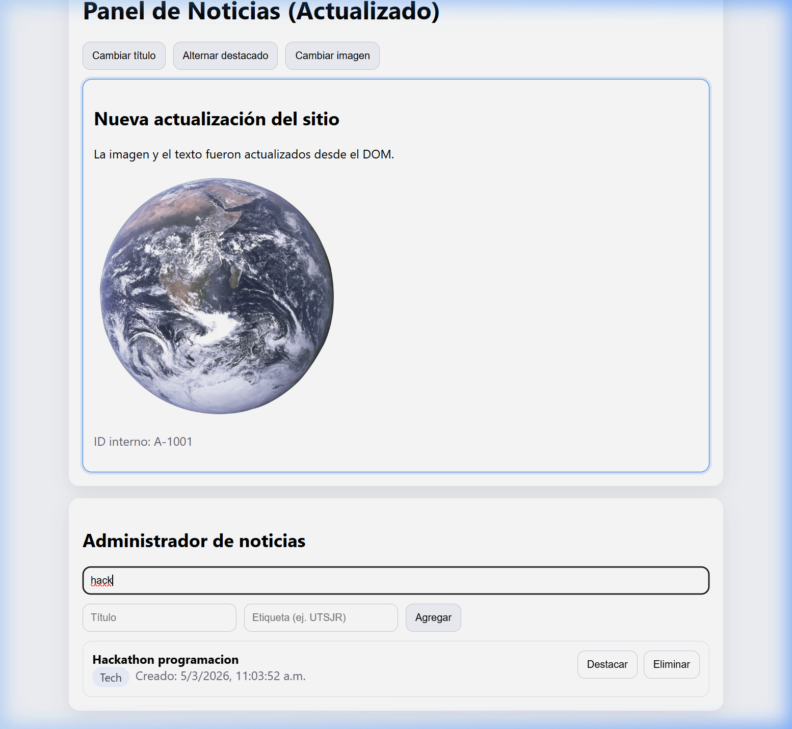

#### Filtro por etiqueta: escribir "UTSJR" → solo muestra "Evento cultural 2026"
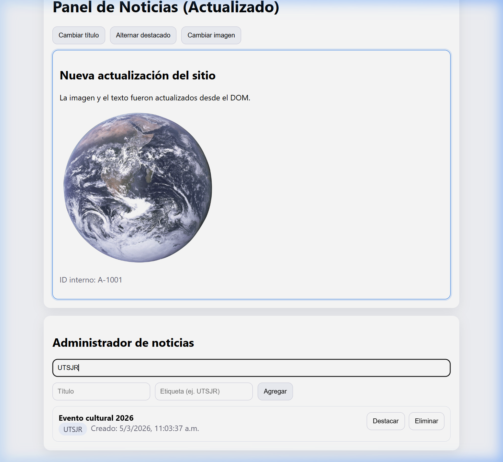

#### Limpiar filtro → todos los items vuelven a aparecer
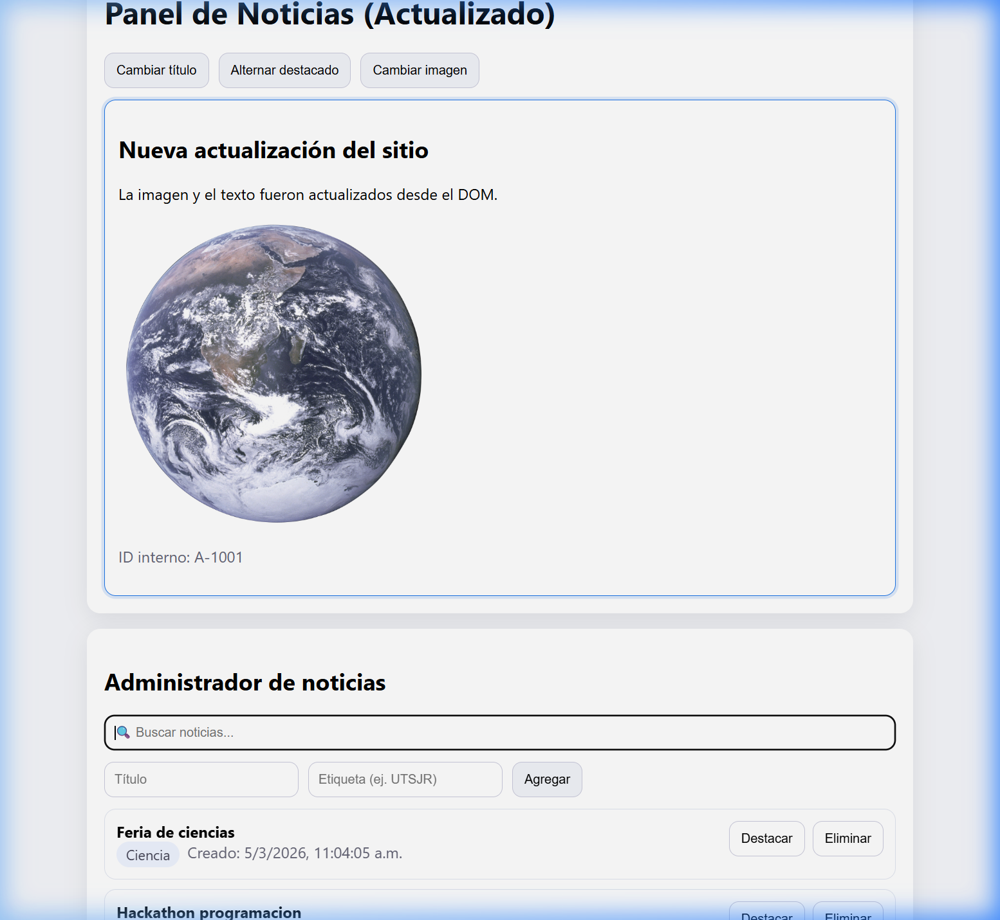

#### 🎥 Video demostración Parte C
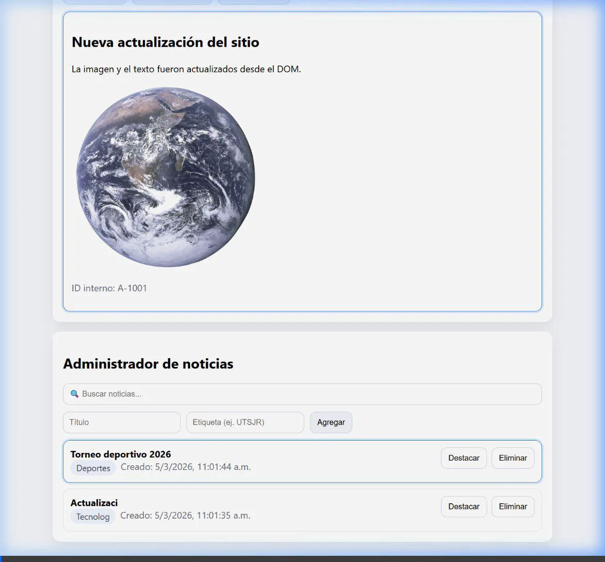

---

## 🧾 Lista de cotejo

- [x] Usa `querySelector`/`getElementById` correctamente
- [x] Actualiza contenido con `textContent`
- [x] Modifica atributos con `setAttribute` o propiedades (ej. `img.src`)
- [x] Manipula clases con `classList`
- [x] Agrega elementos con `createElement` + `append/prepend`
- [x] Elimina elementos con `remove()`
- [x] Implementa delegación de eventos en la lista
- [x] Incluye investigación con fuentes confiables (MDN/WHATWG/OWASP/Chrome DevTools)

---

## 📚 Enlaces consultados

- [DOM Standard (WHATWG)](https://dom.spec.whatwg.org/)
- [MDN DOM Guide](https://developer.mozilla.org/en-US/docs/Web/API/Document_Object_Model)
- [Chrome DevTools](https://developer.chrome.com/docs/devtools/)
- [MDN textContent](https://developer.mozilla.org/en-US/docs/Web/API/Node/textContent)
- [MDN innerHTML](https://developer.mozilla.org/en-US/docs/Web/API/Element/innerHTML)
- [MDN classList](https://developer.mozilla.org/en-US/docs/Web/API/Element/classList)
- [MDN dataset](https://developer.mozilla.org/en-US/docs/Web/API/HTMLElement/dataset)
- [MDN append](https://developer.mozilla.org/en-US/docs/Web/API/Element/append)
- [MDN appendChild](https://developer.mozilla.org/en-US/docs/Web/API/Node/appendChild)
- [MDN Event bubbling](https://developer.mozilla.org/en-US/docs/Learn/JavaScript/Building_blocks/Events)
- [MDN localStorage](https://developer.mozilla.org/en-US/docs/Web/API/Window/localStorage)
- [MDN input event](https://developer.mozilla.org/en-US/docs/Web/API/HTMLElement/input_event)
- [OWASP XSS Prevention](https://cheatsheetseries.owasp.org/cheatsheets/Cross_Site_Scripting_Prevention_Cheat_Sheet.html)
